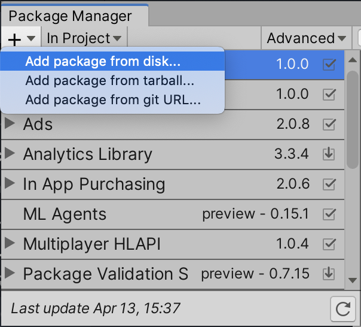
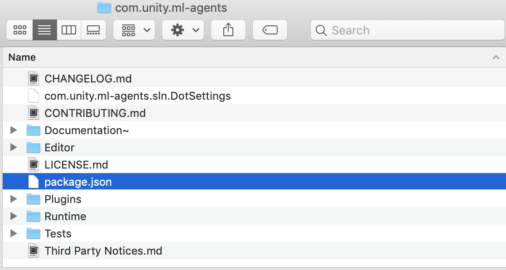

# Installation
Set up your system to use the ML-Agents Toolkit to train and evaluate machine-learning agents in Unity projects.

This process includes installing Unity, configuring Python, and installing the ML-Agents packages. Follow the steps in order to ensure compatibility between Unity and the ML-Agents components.


##  Install Unity

Install Unity 6000.0 or later to use the ML-Agents Toolkit.

To install Unity, follow these steps:

1. [Download Unity](https://unity3d.com/get-unity/download).
2. Use the Unity Hub to manage installations and versions.
   Unity Hub makes it easier to manage multiple Unity versions and associated projects.
4. Verify that the Unity Editor version is 6000.0 or later.

## Install Python 3.10.12 using Conda

Use Conda or Mamba to install and manage your Python environment. This ensures that ML-Agents dependencies are isolated and version-controlled.

To install Python, follow these steps:

1. Install [Conda](https://docs.conda.io/en/latest/) or [Mamba](https://github.com/mamba-org/mamba).
2. Open a terminal and create a new Conda environment with Python 3.10.12:
   
   ```shell
   conda create -n mlagents python=3.10.12 && conda activate mlagents


## Install ML-Agents
You can install ML-Agents in two ways:

* Package installation: Recommended for most users who want to use ML-Agents without modifying the source code.
* Advanced installation: For contributors, developers extending ML-Agents, or users who want access to the example environments.

### Install ML-Agents (Package installation)

Use this method if you don’t plan to modify the toolkit or need the example environments.

#### Install the Unity package

To install the package, follow these steps:

1. In Unity, open **Window** > **Package Manager**.
2. Select **+** > **Add package by name**.
3. Enter `com.unity.ml-agents`.
4. Enable **Preview Packages** under the **Advanced** drop-down list if the package doesn’t appear.

If the package isn’t listed, follow the [Advanced Installation](#32-install-ml-agents---advanced-installation) method instead.


### Install the Python package

Install the ML-Agents Python package to enable communication between Unity and your machine learning training environment.

Using a Python virtual environment helps isolate project dependencies and prevent version conflicts across your system. Virtual environments are supported on macOS, Windows, and Linux. For more information, refer to [Using Virtual Environments](https://github.com/Unity-Technologies/ml-agents/pull/6242/files/Using-Virtual-Environment.md).

1. Before installing ML-Agents, activate the Conda environment you created:


To install, activate your virtual environment and run the following command:

```shell
python -m pip install mlagents==1.1.0
```

which will install the latest version of ML-Agents Python packages and associated dependencies available on PyPi. If building the wheel for `grpcio` fails, run the following command before installing `mlagents` with pip:

```shell
conda install "grpcio=1.48.2" -c conda-forge
```


### Install ML-Agents (Advanced Installation)

Use the advanced installation method if you plan to modify or extend the ML-Agents Toolkit, or if you want to download and use the example environments included in the repository.

#### Clone the ML-Agents repository

Clone the ML-Agents repository to access the source code, sample environments, and development branches.

To clone the latest stable release, run:


Use the command below to clone the repository:

```sh
git clone --branch release_23 https://github.com/Unity-Technologies/ml-agents.git
```


#### Add the ML-Agents Unity package

After cloning the repository, add the `com.unity.ml-agents` Unity package to your project.

To add the local package, follow these steps:

1. In the Unity Editor, go to **Window** > **Package Manager**.
2. In the **Package Manager** window, select **+**.
3. Select **Add package from disk**.
4. Navigate to the cloned repository and open the `com.unity.ml-agents` folder.
5. Select the `package.json` file.

Unity adds the ML-Agents package to your project.

If you plan to use the example environments provided in the repository, open the **Project** folder in Unity to explore and experiment with them.


<p align="center">   </p>


#### Install the ML-Agents Python package

Install the Python packages from the cloned repository to enable training and environment communication.

1. From the root of the cloned repository, activate your virtual environment and run:


To install the `mlagents` Python package, activate your virtual environment and run from the command line:

```sh
cd /path/to/ml-agents
python -m pip install ./ml-agents-envs
python -m pip install ./ml-agents
```

Note that this will install `mlagents` from the cloned repository, _not_ from the PyPi repository. If you installed this correctly, you should be able to run `mlagents-learn --help`, after which you will see the command line parameters you can use with `mlagents-learn`.

If you intend to make modifications to `mlagents` or `mlagents_envs`, from the repository's root directory, run:

```sh
pip3 install torch -f https://download.pytorch.org/whl/torch_stable.html
pip3 install -e ./ml-agents-envs
pip3 install -e ./ml-agents
```

Running pip with the `-e` flag will let you make changes to the Python files directly and have those reflected when you run `mlagents-learn`. It is important to install these packages in this order as the `mlagents` package depends on `mlagents_envs`, and installing it in the other order will download `mlagents_envs` from PyPi.
