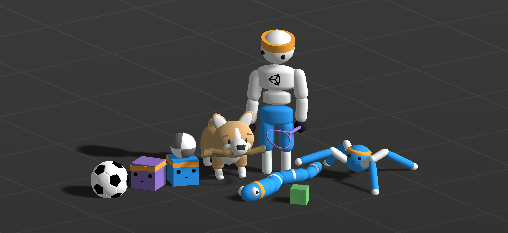

# Unity ML-Agents Toolkit Documentation

Welcome to the comprehensive Unity ML-Agents Toolkit documentation. This documentation is now fully integrated within the Unity package for easy access.

## Quick Navigation

### 🚀 Getting Started
- **[Package Overview](com.unity.ml-agents.md)** - Unity package overview and capabilities
- **[Getting Started](Getting-Started.md)** - Step-by-step setup guide
- **[Installation](Installation.md)** - Complete installation instructions
- **[ML-Agents Overview](ML-Agents-Overview.md)** - Comprehensive feature overview

### 🎮 Creating Learning Environments
- **[Learning Environment Design](Learning-Environment-Design.md)** - Design principles
- **[Creating New Learning Environments](Learning-Environment-Create-New.md)** - Step-by-step creation
- **[Designing Agents](Learning-Environment-Design-Agents.md)** - Agent design guide
- **[Learning Environment Examples](Learning-Environment-Examples.md)** - Example environments

### 🧠 Training & Configuration
- **[Training ML-Agents](Training-ML-Agents.md)** - Complete training guide
- **[Training Configuration File](Training-Configuration-File.md)** - Configuration reference
- **[Training Plugins](Training-Plugins.md)** - Extending training functionality
- **[Using Tensorboard](Using-Tensorboard.md)** - Monitoring training

### 🐍 Python APIs
- **[Python Gym API](Python-Gym-API.md)** - OpenAI Gym interface
- **[Python PettingZoo API](Python-PettingZoo-API.md)** - Multi-agent environments  
- **[Python Low-Level API](Python-LLAPI.md)** - Low-level API access

### ⚡ Advanced Features
- **[Custom Side Channels](Custom-SideChannels.md)** - Custom communication
- **[Inference Engine](Inference-Engine.md)** - Running trained models
- **[Hugging Face Integration](Hugging-Face-Integration.md)** - Model sharing

### ☁️ Cloud & Deployment
- **[Using Docker](Using-Docker.md)** - Containerized training
- **[Amazon Web Services](Training-on-Amazon-Web-Service.md)** - AWS deployment
- **[Microsoft Azure](Training-on-Microsoft-Azure.md)** - Azure deployment

### 📚 Reference & Support
- **[FAQ](FAQ.md)** - Frequently asked questions
- **[Limitations](Limitations.md)** - Known limitations
- **[Migrating](Migrating.md)** - Migration between versions
- **[Background: Machine Learning](Background-Machine-Learning.md)** - ML fundamentals

---

For the most up-to-date information and community support, visit our [GitHub repository](https://github.com/Unity-Technologies/ml-agents).
